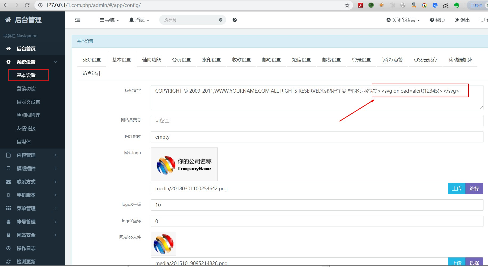
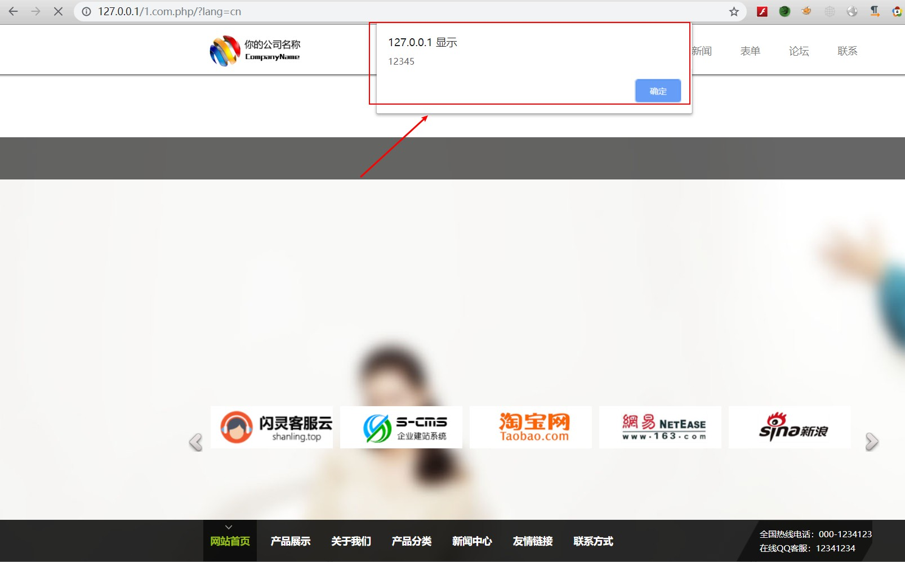

## S-CMS php v3.0 Copyright text input box storage XSS

There is a storage XSS vulnerability in the background of the s-cms enterprise website building system (PHP version). The attacker logs in to the administrator background and puts malicious js code, which will cause all the users visiting the website to be affected by the vulnerability and do great harm.

## exploit

### 1 Client login to management system, modify the content of copyright text box in basic settings of system settings，add`"><svg onload=alert(12345)></svg>`,And then save.

### 2 Any user accessing the site will be subject to an XSS attack

### 3 Vulnerability system is the latest version，[S-CMS Enterprise Station Building System (php version)v3.0](https://cdn.shanling.top/file/1.com.php.zip)
